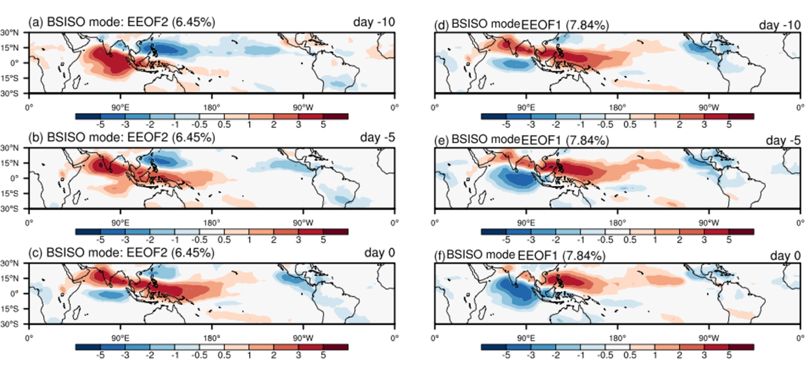

# BSISO Index based on Extended-EOF Analysis

Created by Sandro W. Lubis and Ziming Chen (PNNL)

This script is used to construct BSISO Index based on EEOF (lags -10, -5, and 0) following Kikuchi (2021) https://doi.org/10.2151/jmsj.2021-045

Data: Daily NOAA interpolated OLR dataset (Liebmann & Smith, 1996)
Steps (Kikuchi, 2021):
1. cal_bf_filter.ncl:  Apply 25~90-day Lanczos bandpass filter (Duchon, 1979) to OLR anomaly
2. cal_eeof_olr.ncl: Perform EEOF analysis with three-time lags (–10, –5, and 0 days) on the intraseasonal OLR data (JJASO)
3. cal_bsiso_phase.ncl: Calculate BSISO phase and dates

  

