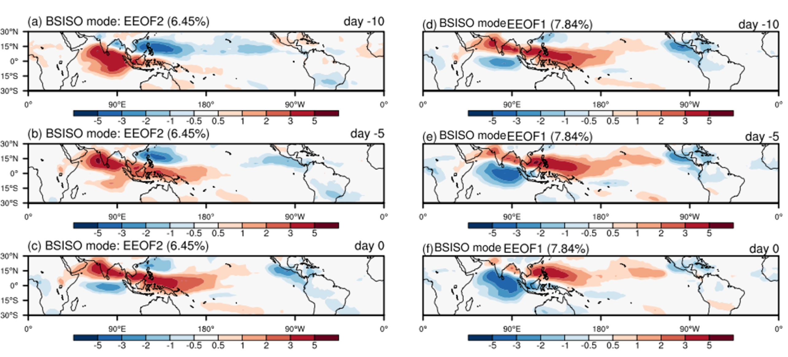

# BSISO Index Based on Extended EOF Analysis

**Dr. Sandro W. Lubis and Dr. Ziming Chen** (PNNL)

This repository provides NCL scripts for constructing the **Boreal Summer Intraseasonal Oscillation (BSISO) Index** using Extended Empirical Orthogonal Function (**EEOF**) analysis following [Kikuchi (2021)](https://doi.org/10.2151/jmsj.2021-045).

The BSISO index is derived from daily NOAA interpolated Outgoing Longwave Radiation (**OLR**) data using three time lags: **−10, −5, and 0 days**.

## Data

* **Variable:** Daily Outgoing Longwave Radiation (OLR)
* **Dataset:** NOAA Interpolated OLR
* **Reference:** Liebmann & Smith (1996)
* **Analysis period:** 1980–2020
* **BSISO phase output:** January 11, 1980 – December 31, 2020
* **Temporal resolution:** Daily
* **Number of output time steps:** 14,966

The BSISO phase record begins on January 11, 1980 because the EEOF construction uses a maximum lag of −10 days.

## Method

The calculation follows the EEOF-based BSISO methodology described by Kikuchi (2021).

### 1. Intraseasonal filtering

```text
cal_bf_filter.ncl
```

* Calculate OLR anomalies.
* Apply a **25–90-day Lanczos bandpass filter** following Duchon (1979).

### 2. Extended EOF analysis

```text
cal_eeof_olr.ncl
```

* Perform EEOF analysis on the filtered OLR anomalies.
* Use three time lags:

  * −10 days
  * −5 days
  * 0 days
* The EEOF analysis is performed using boreal-summer **JJASO** data.

### 3. BSISO phase calculation

```text
cal_bsiso_phase.ncl
```

* Calculate the daily BSISO phase.
* Assign BSISO phases **1–8** based on the EEOF principal components.
* Identify active BSISO days using the normalized amplitude.

## Output

The resulting NetCDF file contains:

```text
bsiso_phase
```

Daily BSISO phase (**1–8**) without applying an amplitude threshold.

```text
bsiso_phase_nAmpGe1
```

BSISO phase for active events with normalized amplitude **> 1**:

* `1–8` : Active BSISO phase
* `0` : Inactive BSISO day (normalized amplitude ≤ 1)

## Example

<p align="center">
  
</p>

## References

**BSISO methodology**

Kikuchi, K. (2021). The Boreal Summer Intraseasonal Oscillation (BSISO): A review. *Journal of the Meteorological Society of Japan, 99*, 933–972.
https://doi.org/10.2151/jmsj.2021-045

**OLR dataset**

Liebmann, B., & Smith, C. A. (1996). Description of a complete (interpolated) outgoing longwave radiation dataset. *Bulletin of the American Meteorological Society, 77*, 1275–1277.

**Lanczos filtering**

Duchon, C. E. (1979). Lanczos filtering in one and two dimensions. *Journal of Applied Meteorology, 18*, 1016–1022.

## Citation

If you use this code or BSISO index, please cite:

Lubis, S. W., Chen, Z., Lu, J., Hagos, S., Chang, C.-C., & Leung, L. R. (2024). Enhanced Pacific Northwest heat extremes and wildfire risks induced by the boreal summer intraseasonal oscillation. *npj Climate and Atmospheric Science, 7*, 232.
https://doi.org/10.1038/s41612-024-00766-3

and the original BSISO methodology:

Kikuchi, K. (2021). The Boreal Summer Intraseasonal Oscillation (BSISO): A review. *Journal of the Meteorological Society of Japan, 99*, 933–972.
https://doi.org/10.2151/jmsj.2021-045
